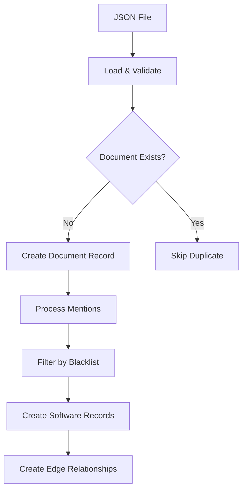
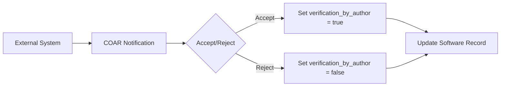

# Database Schema Documentation

## Overview

The COAR Notify INRIA HAL system uses ArangoDB as its primary database, leveraging both document and graph capabilities to store and manage HAL documents and their software mentions. The database is designed to support the complete workflow from document ingestion through software mention extraction, notification sending, and verification tracking.

## Database Configuration

- **Database Name**: `COAR_NOTIFY_DB`
- **Database Type**: ArangoDB (Document + Graph Database)
- **Default Host**: `localhost:8529`
- **Configuration**: Defined in `config.json`

### Configuration File

```json
{
  "ARANGO_CONFIG": {
    "ARANGO_HOST": "localhost",
    "ARANGO_PORT": 8529,
    "ARANGO_DB": "COAR_NOTIFY_DB",
    "ARANGO_USERNAME": "root",
    "ARANGO_PASSWORD": "changeme"
  }
}
```

## Collections

### 1. Documents Collection (`documents`)

**Type**: Document Collection
**Purpose**: Stores HAL documents metadata and serves as the anchor point for software mentions.

#### Schema

```json
{
  "_key": "auto-generated",
  "_id": "documents/123456",
  "file_hal_id": "hal-01478788"  // HAL identifier (string, required)
}
```

#### Fields

| Field | Type | Description | Required |
|-------|------|-------------|----------|
| `_key` | string | Auto-generated unique identifier | Yes |
| `_id` | string | Auto-generated document ID | Yes |
| `file_hal_id` | string | HAL document identifier | Yes |

#### Indexes

- **Unique Index** on `file_hal_id` to prevent duplicate document insertion

---

### 2. Software Collection (`software`)

**Type**: Document Collection
**Purpose**: Stores software mentions extracted from documents with detailed context and attributes.

#### Schema

```json
{
  "_key": "auto-generated",
  "_id": "software/789012",
  "type": "software",
  "software_type": "software",
  "software_name": {
    "rawForm": "DivRank",
    "normalizedForm": "DivRank",
    "offsetStart": 0,
    "offsetEnd": 7
  },
  "context": "DivRank is a PageRank-like method relying on reinforced random walks...",
  "mentionContextAttributes": {
    "used": {"value": false, "score": 5.924701690673828e-05},
    "created": {"value": false, "score": 0.019038617610931396},
    "shared": {"value": false, "score": 1.1920928955078125e-07}
  },
  "documentContextAttributes": {
    "used": {"value": true, "score": 0.9999809265136719},
    "created": {"value": true, "score": 0.6474452614784241},
    "shared": {"value": false, "score": 1.0728836059570312e-06}
  },
  "verification_by_author": false
}
```

#### Fields

| Field | Type | Description | Required |
|-------|------|-------------|----------|
| `_key` | string | Auto-generated unique identifier | Yes |
| `_id` | string | Auto-generated document ID | Yes |
| `type` | string | Type of mention (always "software") | Yes |
| `software_type` | string | Software category | Yes |
| `software_name` | object | Software name details | Yes |
| `software_name.rawForm` | string | Original form as found in text | Yes |
| `software_name.normalizedForm` | string | Normalized form for matching | Yes |
| `software_name.offsetStart` | number | Character position where mention starts | Yes |
| `software_name.offsetEnd` | number | Character position where mention ends | Yes |
| `context` | string | Surrounding text where software was mentioned | Yes |
| `mentionContextAttributes` | object | Confidence scores at mention level | Yes |
| `documentContextAttributes` | object | Confidence scores at document level | Yes |
| `verification_by_author` | boolean | Author verification status | No |

#### Context Attributes

Both `mentionContextAttributes` and `documentContextAttributes` contain confidence scores for three categories:

- **used**: Software was used in the research
- **created**: Software was created by the authors
- **shared**: Software was shared/distributed

Each attribute has:
- `value`: Boolean indicating the classification
- `score`: Float representing confidence level (0.0 to 1.0)

#### Indexes

- **Hash Index** on `software_name.normalizedForm` for efficient software lookup
- **Persistent Index** on `verification_by_author` for filtering verified software

---

### 3. Edge Collection (`edge_doc_to_software`)

**Type**: Edge Collection
**Purpose**: Creates relationships between documents and their software mentions, enabling graph traversal queries.

#### Schema

```json
{
  "_key": "auto-generated",
  "_id": "edge_doc_to_software/345678",
  "_from": "documents/123456",    // Source document ID
  "_to": "software/789012"        // Target software ID
}
```

#### Fields

| Field | Type | Description | Required |
|-------|------|-------------|----------|
| `_key` | string | Auto-generated unique identifier | Yes |
| `_id` | string | Auto-generated edge ID | Yes |
| `_from` | string | Source document ID reference | Yes |
| `_to` | string | Target software ID reference | Yes |

#### Constraints

- Edges can only connect `documents` to `software` collections
- Referential integrity is enforced by ArangoDB

## Data Flow

### 1. Document Ingestion



1. JSON files with `.software.json` extension are uploaded via API
2. Each file contains metadata and a `mentions` array
3. Documents are stored in `documents` collection using HAL ID as `file_hal_id`
4. Duplicate documents are automatically rejected

### 2. Software Extraction

1. Software mentions are extracted from the `mentions` array
2. Each mention is filtered against a blacklist of 255+ generic terms
3. Valid software entries are stored in `software` collection
4. Field normalization occurs (`software-name` → `software_name`)

### 3. Relationship Creation

1. For each valid software mention, an edge is created
2. Links the document (`_from`) to the software (`_to`)
3. Enables complex graph traversal queries
4. Supports aggregation and analysis operations

### 4. COAR Notification Updates



1. External systems send COAR notifications about software verification
2. Notifications can be Accept or Reject actions
3. `verification_by_author` field is updated based on response
4. Updates are applied to all matching software records across documents

## Key Features

### Blacklist System

- **Purpose**: Filters out generic or non-software terms
- **Location**: `./app/static/data/blacklist.csv`
- **Size**: 255+ terms
- **Management**: Full CRUD API for dynamic management

### Provider Detection

The system supports multiple data providers with automatic detection:

- **HAL**: `hal-`, `oai:hal:`, `.hal.` patterns
- **Software Heritage**: `swh-`, `softwareheritage`, `.swh.` patterns
- **Zenodo**: `zenodo-`, `.zenodo.` patterns
- **GitHub**: `github-`, `.github.` patterns

### Notification System

- **COAR Compliant**: Supports standard notification formats
- **Provider-Aware**: Different notification types per provider
- **Bidirectional**: Send and receive verification notifications

### Graph Queries

ArangoDB AQL enables sophisticated queries:

- Document-software relationship traversal
- Aggregation of context attributes by software
- Cross-document software analysis
- Verification status tracking

## Sample AQL Queries

### Get All Software for a Document

```aql
FOR doc IN documents
    FILTER doc.file_hal_id == "hal-01478788"
    FOR edge IN edge_doc_to_software
        FILTER edge._from == doc._id
        LET software = DOCUMENT(edge._to)
        RETURN software
```

### Update Software Verification Status

```aql
FOR doc IN documents
    FILTER doc.file_hal_id == @hal_id
    FOR edge_soft IN edge_doc_to_software
        FILTER edge_soft._from == doc._id
        LET software = DOCUMENT(edge_soft._to)
        FILTER software.software_name.normalizedForm == @software_name
        UPDATE software WITH { verification_by_author: @verification_status } IN software
```

### Aggregate Software Mentions by Context

```aql
FOR doc IN documents
    FILTER doc.file_hal_id == @hal_filename
    FOR edge IN edge_doc_to_software
        FILTER edge._from == doc._id
        LET mention = DOCUMENT(edge._to)
        COLLECT softwareName = mention.software_name.normalizedForm INTO mentionsGroup
        LET maxScores = {
            used: MAX(mentionsGroup[*].mention.documentContextAttributes.used.score),
            created: MAX(mentionsGroup[*].mention.documentContextAttributes.created.score),
            shared: MAX(mentionsGroup[*].mention.documentContextAttributes.shared.score)
        }
        LET maxAttribute = FIRST(
            FOR attr IN ATTRIBUTES(maxScores)
                FILTER maxScores[attr] == MAX(VALUES(maxScores))
                RETURN attr
        )
        RETURN {
            softwareName: softwareName,
            maxDocumentAttribute: maxAttribute,
            contexts: mentionsGroup[*].mention.context
        }
```

## API Endpoints

### Document Management
- `POST /api/document` - Insert new document with software mentions
- `GET /api/software/status` - Get collection statistics
- `GET /api/software/<id>` - Get software by ID
- `GET /api/software_mention/<id>` - Get specific software mention

### Blacklist Management
- `GET /api/blacklist` - View blacklist with search
- `GET /api/blacklist/stats` - Get blacklist statistics
- `POST /api/blacklist` - Add term to blacklist (API key required)
- `DELETE /api/blacklist/<term>` - Remove term from blacklist (API key required)
- `GET /api/blacklist/export` - Export blacklist as CSV
- `POST /api/blacklist/import` - Import blacklist from CSV

### Provider Detection
- `GET /api/software/provider/<filename>` - Detect provider from filename
- `GET /api/software/providers` - List all supported providers

## Performance Considerations

### Indexes
- Unique index on `documents.file_hal_id` prevents duplicates
- Hash index on `software.software_name.normalizedForm` enables fast lookups
- Persistent index on `software.verification_by_author` filters verified content

### Deduplication
- Automatic removal of duplicate software mentions within documents
- JSON hashing for efficient duplicate detection
- Maintains data integrity and query performance

### Concurrency
- Safe collection creation under concurrent load
- Race condition handling for database and collection initialization
- Connection pooling and retry logic for reliability

## Security

### Authentication
- API key required for write operations (blacklist management)
- Environment-based configuration for database credentials
- Input validation and sanitization

### Data Privacy
- No personal data stored in software mentions
- Verification tracking limited to author responses
- Configurable data retention policies

## Backup and Recovery

### Recommended Backup Strategy
1. Regular database snapshots
2. Blacklist CSV version control
3. Configuration file backups
4. Document metadata export

### Recovery Procedures
1. Restore database from snapshot
2. Reload blacklist from CSV
3. Verify collection integrity
4. Test API endpoints

## Monitoring

### Key Metrics
- Document ingestion rate
- Software mention extraction accuracy
- Notification delivery success rate
- Blacklist effectiveness

### Health Checks
- `GET /health` - Database and application health status
- `GET /api/software/status` - Collection statistics
- Database connection monitoring via logs

## Troubleshooting

### Common Issues

1. **Duplicate Documents**: Check unique index on `file_hal_id`
2. **Missing Software Mentions**: Verify blacklist configuration
3. **Notification Failures**: Check provider configuration and network connectivity
4. **Query Performance**: Review indexes and query optimization

### Debug Tools

- ArangoDB web interface for direct database access
- Application logs for detailed error tracking
- API health endpoints for status monitoring
- Blacklist management endpoints for data verification