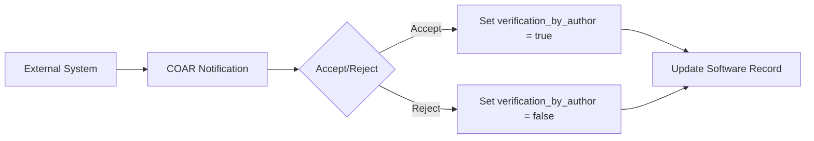

# Database Schema Documentation

## Overview

The COAR Notify INRIA HAL system uses ArangoDB as its primary database, leveraging both document and graph capabilities to store and manage HAL documents and their software mentions. The database is designed to support the complete workflow from document ingestion through software mention extraction, notification sending, and verification tracking.

## Database Configuration

- **Database Name**: `COAR_NOTIFY_DB`
- **Database Type**: ArangoDB (Document + Graph Database)
- **Default Host**: `localhost:8529`
- **Configuration**: Environment variables (see `.env.example` and `README.md`)

### Relevant environment variables

```
ARANGO_HOST=localhost
ARANGO_PORT=8529
ARANGO_DB=COAR_NOTIFY_DB
ARANGO_USERNAME=root
ARANGO_ROOT_PASSWORD=examplepassword
```

## Collections

### 1. Documents Collection (`documents`)

**Type**: Document Collection
**Purpose**: Stores HAL documents metadata and serves as the anchor point for software mentions.

#### Schema

```json
{
  "_key": "auto-generated",
  "_id": "documents/123456",
  "file_hal_id": "hal-01478788"  // HAL identifier (string, required)
}
```

#### Fields

| Field | Type | Description | Required |
|-------|------|-------------|----------|
| `_key` | string | Auto-generated unique identifier | Yes |
| `_id` | string | Auto-generated document ID | Yes |
| `file_hal_id` | string | HAL document identifier | Yes |

#### Indexes

- **Unique Index** on `file_hal_id` to prevent duplicate document insertion

---

### 2. Software Collection (`software`)

**Type**: Document Collection
**Purpose**: Stores software mentions extracted from documents with detailed context and attributes.

#### Schema

```json
{
  "_key": "auto-generated",
  "_id": "software/789012",
  "type": "software",
  "software_type": "software",
  "software_name": {
    "rawForm": "DivRank",
    "normalizedForm": "DivRank",
    "offsetStart": 0,
    "offsetEnd": 7
  },
  "context": "DivRank is a PageRank-like method relying on reinforced random walks...",
  "mentionContextAttributes": {
    "used": {"value": false, "score": 5.924701690673828e-05},
    "created": {"value": false, "score": 0.019038617610931396},
    "shared": {"value": false, "score": 1.1920928955078125e-07}
  },
  "documentContextAttributes": {
    "used": {"value": true, "score": 0.9999809265136719},
    "created": {"value": true, "score": 0.6474452614784241},
    "shared": {"value": false, "score": 1.0728836059570312e-06}
  },
  "blacklisted": false,
  "quality_score": 0.9381,
  "quality_invalid": false,
  "verification_by_author": false,
  "created_at": "2026-04-16T07:30:00.000000+00:00"
}
```

#### Fields

| Field | Type | Description | Required |
|-------|------|-------------|----------|
| `_key` | string | Auto-generated unique identifier | Yes |
| `_id` | string | Auto-generated document ID | Yes |
| `type` | string | Type of mention (always "software") | Yes |
| `software_type` | string | Software category | Yes |
| `software_name` | object | Software name details | Yes |
| `software_name.rawForm` | string | Original form as found in text | Yes |
| `software_name.normalizedForm` | string | Normalized form for matching | Yes |
| `software_name.offsetStart` | number | Character position where mention starts | Yes |
| `software_name.offsetEnd` | number | Character position where mention ends | Yes |
| `context` | string | Surrounding text where software was mentioned | Yes |
| `mentionContextAttributes` | object | Confidence scores at mention level | Yes |
| `documentContextAttributes` | object | Confidence scores at document level | Yes |
| `blacklisted` | boolean | Set at ingestion when the normalized name is on the blacklist; excludes the mention from notifications | No |
| `quality_score` | number\|null | P(valid) in [0,1] from the structural-validity classifier, set at ingestion when `MENTION_QUALITY_FILTER_ENABLED=true` (else `null`) | No |
| `quality_invalid` | boolean | `true` when `quality_score` is below `MENTION_QUALITY_FILTER_THRESHOLD`; excludes the mention from notifications while the Mention Quality Filter is enabled | No |
| `verification_by_author` | boolean | Author verification status | No |
| `created_at` | string | ISO-8601 UTC ingestion timestamp | No |

#### Context Attributes

Both `mentionContextAttributes` and `documentContextAttributes` contain confidence scores for three categories:

- **used**: Software was used in the research
- **created**: Software was created by the authors
- **shared**: Software was shared/distributed

Each attribute has:
- `value`: Boolean indicating the classification
- `score`: Float representing confidence level (0.0 to 1.0)

#### Indexes

Ensured at startup / first access from `DatabaseManager.COLLECTION_INDEXES` (all persistent):

- `blacklisted` — filtering blacklisted mentions.
- `quality_invalid` — filtering Mention Quality Filter–flagged mentions.
- `created_at` — the newest-first sort (latest mentions) and the per-day histogram/timeseries range.
- Compound `[blacklisted, quality_invalid, created_at]` — the combined filter-then-sort queries
  (e.g. `/api/software/latest?quality_invalid=true`).

---

### 3. Edge Collection (`edge_doc_to_software`)

**Type**: Edge Collection
**Purpose**: Creates relationships between documents and their software mentions, enabling graph traversal queries.

#### Schema

```json
{
  "_key": "auto-generated",
  "_id": "edge_doc_to_software/345678",
  "_from": "documents/123456",    // Source document ID
  "_to": "software/789012"        // Target software ID
}
```

#### Fields

| Field | Type | Description | Required |
|-------|------|-------------|----------|
| `_key` | string | Auto-generated unique identifier | Yes |
| `_id` | string | Auto-generated edge ID | Yes |
| `_from` | string | Source document ID reference | Yes |
| `_to` | string | Target software ID reference | Yes |

#### Constraints

- Edges can only connect `documents` to `software` collections
- Referential integrity is enforced by ArangoDB

---

### 4. Received Notifications Collection (`received_notifications`)

**Type**: Document Collection
**Purpose**: Persists every inbound COAR notification accepted by `POST /inbox` (after the SWH-origin loop-prevention filter). Used by `GET /notifications` to render an HTML log for inspection.

#### Schema

```json
{
  "_key": "auto-generated",
  "_id": "received_notifications/123456",
  "received_at": "2026-04-16T07:30:00.000000Z",
  "origin": "swh",
  "payload": { "...": "raw COAR JSON-LD as received" }
}
```

#### Fields

| Field | Type | Description | Required |
|-------|------|-------------|----------|
| `_key` | string | Auto-generated unique identifier | Yes |
| `_id` | string | Auto-generated document ID | Yes |
| `received_at` | string | ISO-8601 UTC timestamp (`Z` suffix) of arrival | Yes |
| `origin` | string \| null | Derived sender classification: `swh`, `hal`, or `unknown` | No |
| `payload` | object | The raw notification body as received | Yes |

#### Access

- Written by `DatabaseManager.store_received_notification` (see `app/utils/db.py`)
- Read by `DatabaseManager.list_received_notifications` (newest-first, limit-bounded)

---

### 5. Blacklist Collection (`blacklist`)

**Type**: Document Collection
**Purpose**: Persistent store of blacklisted software names. A name on this list does not block ingestion;
it marks matching mentions `blacklisted: true` so they are excluded from outbound notifications.

#### Schema

```json
{
  "_key": "auto-generated",
  "_id": "blacklist/8873932",
  "name": "Python"
}
```

#### Fields

| Field | Type | Description | Required |
|-------|------|-------------|----------|
| `_key` | string | Auto-generated unique identifier | Yes |
| `_id` | string | Auto-generated document ID | Yes |
| `name` | string | A blacklisted normalized software name | Yes |

#### Indexes

- **Unique Index** on `name` — makes adds idempotent at the DB level and speeds membership lookups

#### Lifecycle

- Seeded once from `app/static/data/blacklist.csv` at startup (`seed_blacklist_from_csv`, no-op once populated)
- Managed at runtime via `DatabaseManager.add_blacklist_term` / `remove_blacklist_term` / `clear_blacklist`
  and the `/api/blacklist*` endpoints (and the `/blacklist` web UI)
- Read into a set by `get_blacklist_terms`; consumed at ingestion (to set the flag) and by
  `reapply_blacklist` (to recompute flags on existing mentions)

## Data Flow

### 1. Document Ingestion

```mermaid
graph TD
    A[JSON File] --> B[Load & Validate]
    B --> C{Document Exists?}
    C -->|No| D[Create Document Record]
    C -->|Yes| E[Skip Duplicate]
    D --> F[Process Mentions]
    F --> G[Flag against Blacklist]
    G --> M[Score with classifier if MENTION_QUALITY_FILTER_ENABLED]
    M --> H[Create Software Records (all, with blacklisted + model flags)]
    H --> I[Create Edge Relationships]
```

1. JSON files with `.software.json` extension are uploaded via API
2. Each file contains metadata and a `mentions` array
3. Documents are stored in `documents` collection using HAL ID as `file_hal_id`
4. Duplicate documents are automatically rejected

### 2. Software Extraction

1. Software mentions are extracted from the `mentions` array
2. Each mention is checked against the `blacklist` collection and stamped with `blacklisted: true|false`
   (no mention is dropped)
3. When `MENTION_QUALITY_FILTER_ENABLED=true`, each mention is also scored by the structural-validity classifier
   and stamped with `quality_score` and `quality_invalid` (no mention is dropped). When disabled, both are unset.
4. **All** mentions are stored in the `software` collection
5. Field normalization occurs (`software-name` → `software_name`)

Both signals are enforced later, when notifications are built: mentions flagged `blacklisted` (always) or
`quality_invalid` (only while the Mention Quality Filter is enabled) are excluded from what is sent to providers.
The two filters are independent — see the [Mention Quality Filter](mention-quality-filter.md)
section of the README.

Both flags can be recomputed on already-stored mentions: `reapply_blacklist` (`POST /api/blacklist/reapply`)
for the blacklist, and `reapply_mention_quality` (`POST /api/mention-quality/reapply`, with
`GET /api/mention-quality/stats` and the `/mention-quality` web UI) for the Mention Quality Filter. Use the
latter to backfill mentions ingested before the filter existed or to re-score after retraining.

### 3. Relationship Creation

1. For each software mention, an edge is created
2. Links the document (`_from`) to the software (`_to`)
3. Enables complex graph traversal queries
4. Supports aggregation and analysis operations

### 4. COAR Notification Updates


```mermaid
graph LR
    A[External System] --> B[COAR Notification]
    B --> C{Accept/Reject}
    C -->|Accept| D[Set verification_by_author = true]
    C -->|Reject| E[Set verification_by_author = false]
    D --> F[Update Software Record]
    E --> F
```

1. External systems send COAR notifications about software verification
2. Notifications can be Accept or Reject actions
3. `verification_by_author` field is updated based on response
4. Updates are applied to all matching software records across documents

## Key Features

### Blacklist System

- **Purpose**: Flags generic or non-software terms so they are excluded from notifications (mentions are
  still stored, not dropped)
- **Storage**: ArangoDB `blacklist` collection (persistent); seeded once from `./app/static/data/blacklist.csv`
- **Management**: Full CRUD API plus a `/blacklist` web UI; `reapply` recomputes flags on existing mentions,
  and `match-count` is a read-only impact dry run

### Provider Detection

`detect_provider_from_document_data` in `app/utils/notification_handler.py` dispatches based on the document ID prefix (case-insensitive):

- **HAL**: `oai:hal:` prefix → `ActionReview` notifications
- **Software Heritage**: `swh:` prefix → `RelationshipAnnounce` notifications
- **Anything else**: returns `UNKNOWN` and is not dispatched

### Notification System

- **COAR Compliant**: Supports standard notification formats
- **Provider-Aware**: Different notification types per provider
- **Bidirectional**: Send and receive verification notifications

### Graph Queries

ArangoDB AQL enables sophisticated queries:

- Document-software relationship traversal
- Aggregation of context attributes by software
- Cross-document software analysis
- Verification status tracking

## Sample AQL Queries

### Get All Software for a Document

```aql
FOR doc IN documents
    FILTER doc.file_hal_id == "hal-01478788"
    FOR edge IN edge_doc_to_software
        FILTER edge._from == doc._id
        LET software = DOCUMENT(edge._to)
        RETURN software
```

### Update Software Verification Status

```aql
FOR doc IN documents
    FILTER doc.file_hal_id == @hal_id
    FOR edge_soft IN edge_doc_to_software
        FILTER edge_soft._from == doc._id
        LET software = DOCUMENT(edge_soft._to)
        FILTER software.software_name.normalizedForm == @software_name
        UPDATE software WITH { verification_by_author: @verification_status } IN software
```

### Aggregate Software Mentions by Context

```aql
FOR doc IN documents
    FILTER doc.file_hal_id == @hal_filename
    FOR edge IN edge_doc_to_software
        FILTER edge._from == doc._id
        LET mention = DOCUMENT(edge._to)
        COLLECT softwareName = mention.software_name.normalizedForm INTO mentionsGroup
        LET maxScores = {
            used: MAX(mentionsGroup[*].mention.documentContextAttributes.used.score),
            created: MAX(mentionsGroup[*].mention.documentContextAttributes.created.score),
            shared: MAX(mentionsGroup[*].mention.documentContextAttributes.shared.score)
        }
        LET maxAttribute = FIRST(
            FOR attr IN ATTRIBUTES(maxScores)
                FILTER maxScores[attr] == MAX(VALUES(maxScores))
                RETURN attr
        )
        RETURN {
            softwareName: softwareName,
            maxDocumentAttribute: maxAttribute,
            contexts: mentionsGroup[*].mention.context
        }
```

## API Endpoints

See [API Documentation](api.md) for the full endpoint reference. This file focuses on the database schema only.

## Performance Considerations

### Indexes

The following persistent indexes are created automatically in code, the first
time each collection is accessed, by `DatabaseManager._ensure_indexes` (driven
by the `COLLECTION_INDEXES` registry in `app/utils/db.py`). Creation is
idempotent, so it is safe across restarts and concurrent workers.

| Collection | Field(s) | Type | Purpose |
|------------|----------|------|---------|
| `documents` | `file_hal_id` | persistent, **unique** | Prevents duplicate HAL documents at the DB level (in addition to the app-level `document_exists` check) and speeds up lookups by HAL id — including the `get_software_notifications` hot path |
| `documents` | `created_at` | persistent | Newest-first listing (`get_latest_documents`) and the per-day documents histogram |
| `received_notifications` | `origin` | persistent | Speeds up filtering notifications by origin (`swh` / `hal` / `unknown`) |
| `received_notifications` | `received_at` | persistent | Speeds up the newest-first (`SORT ... DESC`) listing |
| `blacklist` | `name` | persistent, **unique** | Makes term adds idempotent and speeds membership lookups |
| `software` | `blacklisted` | persistent | Blacklisted-mention filters/counts |
| `software` | `quality_invalid` | persistent | Quality-invalid filters/counts |
| `software` | `created_at` | persistent | Newest-first listing (`get_latest_mentions`) and per-day histograms |
| `software` | `blacklisted, quality_invalid, created_at` | persistent (compound) | Combined filter-then-sort listings (latest mentions narrowed by flag) |
| `software` | `software_name.normalizedForm` | persistent | Distinct-name counts (dashboard + mention-quality), blacklist match-count, by-name lookups |
| `software` | `quality_score` | persistent | "Scored" counts for the Mention Quality Filter |

The edge collection `edge_doc_to_software` needs no declared index: ArangoDB
automatically maintains an edge index on `_from` / `_to`, which serves the
document→software traversal in `get_software_notifications` and
`get_all_software_for_document`.

**Adding an index:** append a spec to the collection's list in
`COLLECTION_INDEXES` (`app/utils/db.py`); `_ensure_indexes` creates it
idempotently on next access. An index is warranted when a query **filters or
sorts** on a field over a large collection — not merely reads it. For example,
the `documentContextAttributes` / `mentionContextAttributes` fields are only
projected (never filtered) by `get_software_notifications`, so they need no
index.

> **Not yet indexed in code:** filtering on `software.verification_by_author`
> would benefit from an index, but that access pattern is not currently
> optimized. Add an entry to `COLLECTION_INDEXES` if/when it does.

### Deduplication
- Automatic removal of duplicate software mentions within documents
- JSON hashing for efficient duplicate detection
- Maintains data integrity and query performance

### Concurrency
- Safe collection creation under concurrent load
- Race condition handling for database and collection initialization
- Connection pooling and retry logic for reliability

## Security

### Authentication
- API key (`x-api-key`) required for document write operations (`POST`/`DELETE /api/document`)
- Blacklist write endpoints are **not** API-key protected (they back the public `/blacklist` UI); restrict
  them at the reverse proxy if needed
- Environment-based configuration for database credentials
- Input validation and sanitization

### Data Privacy
- No personal data stored in software mentions
- Verification tracking limited to author responses
- Configurable data retention policies

## Backup and Recovery

### Recommended Backup Strategy
1. Regular database snapshots (the `blacklist` collection is part of the DB, so snapshots capture it)
2. Keep the seed `blacklist.csv` under version control as a baseline
3. Configuration file backups
4. Document metadata export

### Recovery Procedures
1. Restore database from snapshot
2. If the `blacklist` collection is empty, restart (re-seeds from CSV) or `POST /api/blacklist/reload`
3. Verify collection integrity
4. Test API endpoints

## Monitoring

### Key Metrics
- Document ingestion rate
- Software mention extraction accuracy
- Notification delivery success rate
- Blacklist effectiveness

### Health Checks
- `GET /health` - Database and application health status
- `GET /api/software` - Collection statistics
- Database connection monitoring via logs

## Troubleshooting

### Common Issues

1. **Duplicate Documents**: Check unique index on `file_hal_id`
2. **Missing Software Mentions**: Verify blacklist configuration
3. **Notification Failures**: Check provider configuration and network connectivity
4. **Query Performance**: Review indexes and query optimization

### Debug Tools

- ArangoDB web interface for direct database access
- Application logs for detailed error tracking
- API health endpoints for status monitoring
- Blacklist management endpoints for data verification